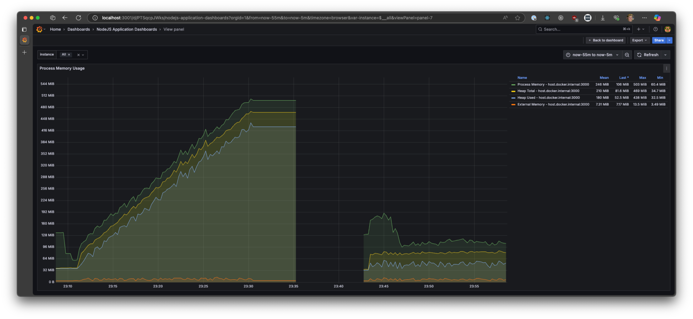
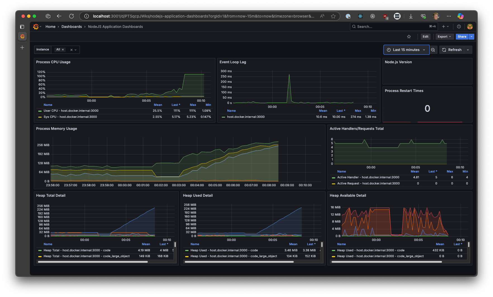

This repo is meant to demonstrate a memory leak in RTKQ 1.9.6

At it's core is a Next.js project that uses `@reduxjs/toolkit@1.9.6` and `next-redux-wrapper` to preload information from the pokemon api in `getServerSideProps` for SSR. The service exposes some metrics using `prom-client` on an API route.

You can run the Next.js project as-is but this repo has a docker compose file that sets up some monitoring with Prometheus, Thanos and Grafana, to scrape the metrics api route and create a dashboard (this is roughly the same dashboard we use at work, and first observed the memory leak on)

To start, run `docker compose up` in the root of the project. 4 services will be created:

- http://localhost:9090 -> Prometheus
- http://localhost:19191 -> Thanos
- http://localhost:3001 -> Grafana
- http://localhost:3000 -> Next.js

Verify you can see the Next.js page by accessing `http://localhost:3000/?name=bulbasaur&keyA=A&keyB=B`. The `keyA` and `keyB` query params serve only to fragment the RTKQ query cache - the page will fetch pokemon by name.

There is a dashboard 'NodeJS Application dashboard' viewable in Grafana that shows the characteristic curve of the memory leak under a chart 'Process Memory Usage'. Log into Grafana with admin/admin (you can skip resetting the master password). Prometheus will scrape metrics from http://localhost:3000/api/prometheus every 5 seconds. The dashboard should be visible at http://localhost:3001/d/PTSqcpJWks/nodejs-application-dashboards

Simulate load by running `node load.js`. This will make a request to the Next.js site every 500ms. This will result in a memory leak which will be visible on the dashboard. I left this running for ~20 mins, on the left is with 1.9.6, and on the right after I restarted with 1.9.5



Here again, after restarting with 1.9.6 at ~00:03, we immediately see memory increase. In this run I'd run Next.js with `NODE_OPTIONS=--max-old-space-size=256`, and the halt in monitoring is not me stopping the service - it's a Node.js Heap OOM:



> rtkq-memory-leak@0.1.0 start /app
> next start
>
> ▲ Next.js 15.3.1
> - Local:        http://localhost:3000
> - Network:      http://192.168.97.3:3000
>
> ✓ Starting...
> ✓ Ready in 1102ms
> Warning: data for page "/" (path "/?name=growlithe&keyA=m8a2jby988&keyB=9of8z88f44") is 262 kB which exceeds the threshold of 128 kB, this amount of data can reduce performance.
> See more info here: https://nextjs.org/docs/messages/large-page-data
>
> <--- Last few GCs --->
>
> [18:0xffff822f0620]   418746 ms: Mark-Compact (reduce) 253.4 (263.2) -> 253.1 (260.5) MB, 3.76 / 0.02 ms  (+ 61.7 ms in 782 steps since start of marking, biggest step 2.8 ms, walltime since start of marking 72 ms) (average mu = 0.264, current mu = 0.287) [18:0xffff822f0620]   418758 ms: Scavenge 254.3 (260.5) -> 253.4 (261.5) MB, 0.74 / 0.00 ms  (average mu = 0.264, current mu = 0.287) allocation failure;
>
>
> <--- JS stacktrace --->
>
> FATAL ERROR: Ineffective mark-compacts near heap limit Allocation failed - JavaScript heap out of memory
> ----- Native stack trace -----
>
> ELIFECYCLE  Command failed.

You should be able to recreate this; the `load.js` script will start to log fetch failures:

```
http://localhost:3000/?name=wartortle&keyA=h3tcsgclnr&keyB=joaxur7hed
Fetch error: fetch failed
http://localhost:3000/?name=jigglypuff&keyA=eaphczf8ky&keyB=sourm3djdk
Fetch error: fetch failed
```

And Next.js show OOM.
